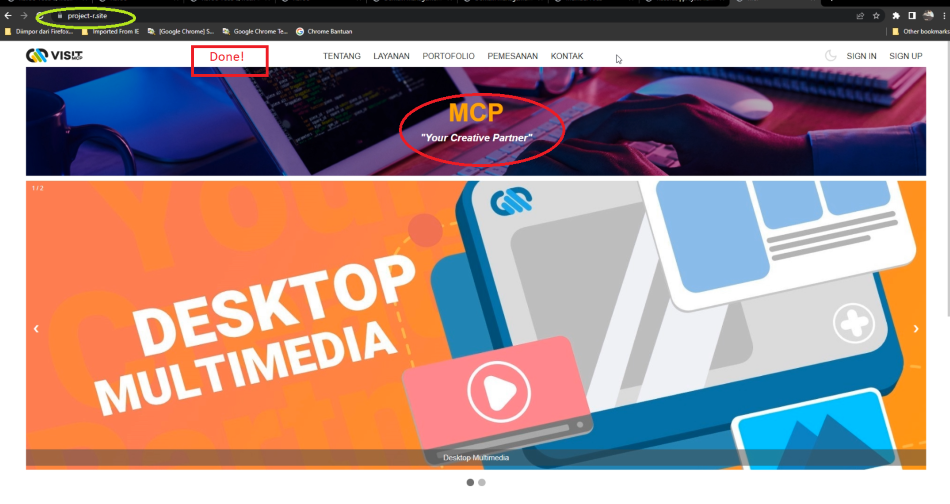

# Moringa Cipta Pratama (MCP)
## About

Welcome to MCP. 
_"Your Creative Partner"_

Kami adalah MCP, sebuah lembaga yang bergerak di bidang jasa desain, animasi, video editing, games, augmented reality, arsitektural 3D dan multimedia interaktif berbasis mobile maupun desktop.

Kunjungi website kami, dan wujudkan ide anda, bersama MCP.

## Deployment links

[https://visitmcp.netlify.app](https://visitmcp.netlify.app/)

[project-r.site](https://project-r.site/)

[www.project-r.site](https://www.project-r.site/)

## Website Features

- Sign up and log in to make sure you can keep in touch with us
- Detailed services for your future projects with us 
- Great accessibility for users across platforms and devices
- and many more

There are many more to come, just stay tuned.
## Website Development
## Tools
This website mainly uses three different ingredients, they are:
- HTML
- CSS
- JavaScript

## How to use

To run this website, we can use both offline and online methods.

To run this website in offline mode, you can manually open the html file and open it in your favorite browser.

To run this website in online mode, you can follow the instructions:
- Go to [GitHub](https://github.com/RevoU-FSSE-2/week-5-Hananjaya)  
- Clone the repository 
- Open the project using your favorite code editor.
## Development
In the development phase, we would like to highlight some features, such as:
- Mobile-first approach

- Setting up the responsive

- Integrated Terminal in Visual Code Studio

## Custom Domain and Deployment

**IMPORTANT**

In this website, we use the **previous custom domain** we bought from [Niagahoster](https://www.niagahoster.co.id/).

If you are first time to deploy, proceed to the next section of the deployment.

**DISCLAIMER**

This method links our **new** repository [https://github.com/RevoU-FSSE-2/week-5-Hananjaya](https://github.com/RevoU-FSSE-2/week-5-Hananjaya) / [https://visitmcp.netlify.app/](https://visitmcp.netlify.app/) to the domain we use in the previous project site. 

Regarding this method, we have to admit that we run a website entitled **"MCP"** in a domain named **"project-r.site"**. **A bit pathetic** but it doesn't really matter for now.

The method were:

- Go to the **previous** [netlify](https://www.netlify.com/) deployment (with custom domain we bought)
- Remove the domain from the list.

- Go to the **new** [netlify](https://www.netlify.com/) deployment (deployed from the new repository)
- Add the existing domain.
  

- Go to [cloudflare](https://www.cloudflare.com)
- Edit the DNS, so that the existing domain will redirect to the new content.

- Done!. Now we are running the [content](https://project-r.site/) with different domain name.

## First time to deploy
Before we proceed to the deployment, we need to create custom domain for the website. In this case, we use Niagahoster and Cloudflare. Here is the brief description of the process:
#### Netlify

1. Go to [Netlify](https://www.netlify.com/)
2. Complete the signing process
3. Choose **Deploy with GitHub**
   
    

4. To add new sites, choose **import an existing project**
   
    

5. Select the repository you want to deploy
   
    

6. Customize your unique site name in **site overview** > **Domain settings**
   
    

7. You are good to go!
   
    

#### Niagahoster
1. Go to [Niagahoster](https://www.niagahoster.co.id/)
2. Complete the signing process
3. Check the availability of your unique custom site name
4. Choose the payment method and complete the payment process
5. you should be redirected to this page, wait for the status to be updated to **active**
   
    
6. Proceed to the next step, setting up the Cloudflare

#### Cloudflare
1. Go to [Cloudflare](https://www.cloudflare.com)
2. Complete the signing process
3. Add your unique custom site you just brought from Niagahoster
   
    
   
4. Choose your subscription plan
   
    

5. Go to **DNS** > **Record** > **Cloudflare Nameservers**, copy the Nameservers 
   
    

6. Go back to Niagahoster, replace the nameservers with the ones provided by Cloudflare
   
    

7.  In DNS Record, add record by choosing the type, Name, and Target.
   
    

8.  The result will be:
   
    

9.  Go to Netlify, choose **Add a Domain** in Domain management.
    
    

10. Complete the process
    
    

11. Finish, _salam luar biasa_